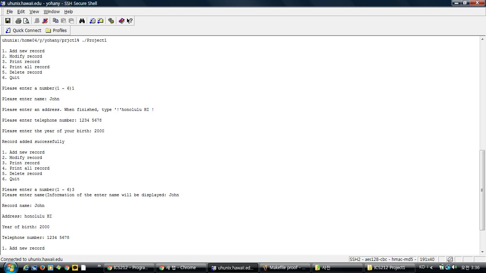

This is an address book program that I made in ICS 212. C and unix environment were used since the course was conducted to use C and SSH UH Unix. The program itself is simple, it prompts users to add, print, modify, print all, delete, and clean up the records. Makefile using SCCS was used to preserve and combine all the source codes to create executable file.

Address book program is probably sounded familiar for many ICS, CS, or CE student as assignments or projects. It might see as simple coding project but with a new environment, not eclipse but SSH Unix with a new language, it made the project really challenging for me. Coding with C in Unix environment was a whole new experience. While Java does all the compilation, compiling and linking and all the processes were had to be done manually. Also the concept of pointer, which can be very useful or could become the reason for hating C, came to me as big challenge too.

However, through this project, I was able to see the potentials of C and learned how to use new language and the concept of pointers, SCCS, compiling, and linking.

