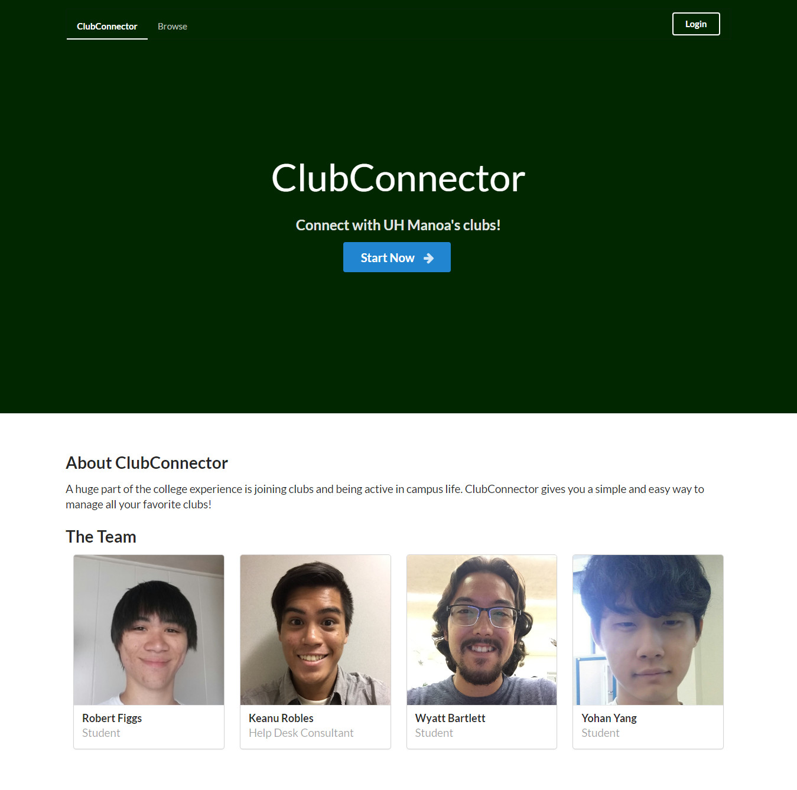
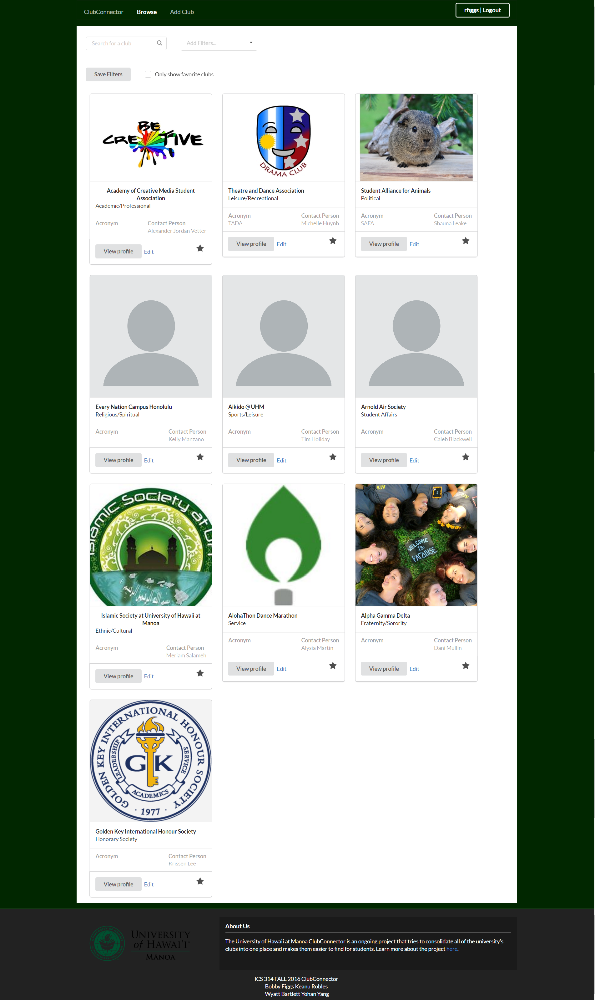

ClubConnector

Club connector is a web application that I worked on as a group project for software engineering course at University of Hawaii at Manoa. Simply, Club connector is created with the purpose of helping UH Manoa students to search and to find the clubs that best fit for them. Browsing for club and some functions are available for everyone to use, however, since the app was built for student use, certain functionalities require University of Hawaii id and password.

While developing the app with project teammates, Keanu Robles, Robert Figgs, Wyatt Bartlett, I was contributing to the team by making landing page, user interface on browse club page, adjustments on footer page, design part on the browse club page, and meteor deployment.

Through working on the project as team, I was able to experience how important and good to have working as group, not alone. Since this was my first group project that involved coding, I might telling the good points of it mostly, however, coping with the difficulties, putting ideas, making decision together were important and valuable experiences for me before I jump into the area for working. Lastly, I want to say thank you to my teammates who went through the project together.

