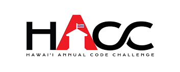

Hawaii Annual Code Challenge, it has been only two years including this year of 2017, it was also my first time participating any kind of coding challenges. I have been heard of various hackathons from school or online but I was either not interested or time was not available. However, thanks to the ICS 491 course I was able to join the HACC 2017 as team GoldenEye, not spectator. I think I have made mistakes or missed some moments while the HACC was going on, but I think I have also gain many things, including experiences, relationships with people, processes, and excitement.

HRS GoldenEye is in challenge of making Hawaii Revised Statutes to be easily searched and shared. In Hawaii Revised Statutes webpage, the statutes are in raw texts without search method or database, so it is really tired and irritating for those who searching for the statutes that they are looking for. So, our team’s goal was to implement searching with database that will allow people to search the statutes stored in the database. Not only to that, we also thought of showing related statutes after searching and putting sharing feature too. 
Laravel packages, Blade, Eloquent search, and BootStrap 4 are used for the project and since I not much experiences about Laravel, so Laracast which has tutorials for Laravel helped in many ways.

If you want to see our work, the GitHub for the project can be found <a href="https://github.com/HRSgoldeneye/goldeneye.github.io/">here</a>.
